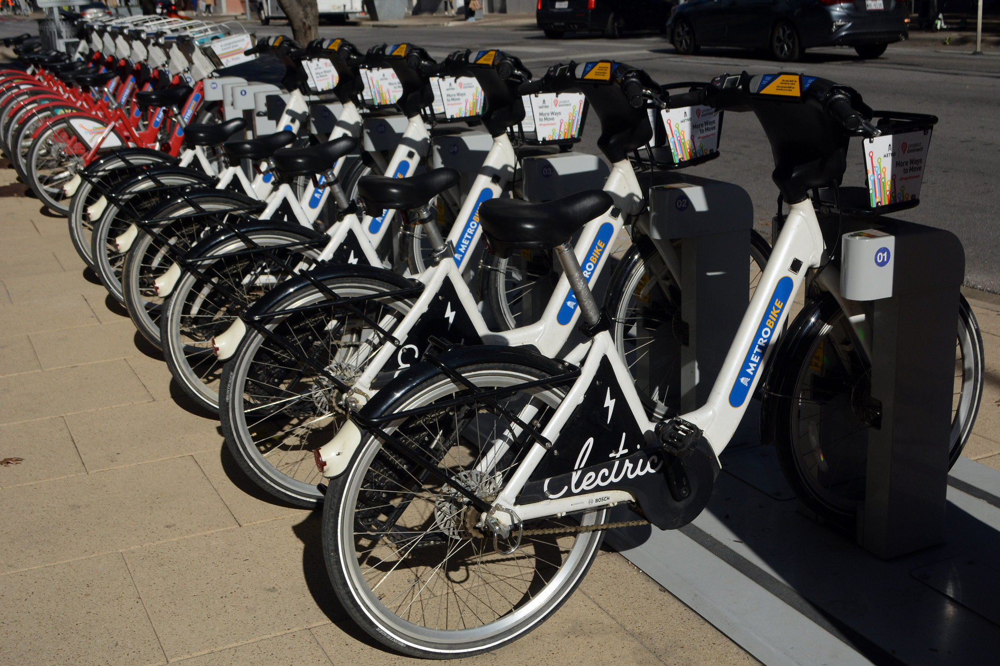

# Austin Metrobike Expansion Scoring 🚲

Using data to estimate good places for new [MetroBike](https://austin.bcycle.com/) kiosk locations.

*Disclaimer: This is a personal project of mine. Not an official project of CapMetro or the City of Austin*

## Data Sources:

### Walkability

The Environmental Protection Agency (EPA) provides walkability estimates for census block groups: https://www.epa.gov/smartgrowth/smart-location-mapping#walkability

### Transit Access

The EPA also estimates transit access in meters by census block groups:
https://www.epa.gov/smartgrowth/smart-location-mapping#Trans45

### Micromobility Trips

The number of micromobility trips (dockless scooters/bicycles) started or ended in a census tract. Data is provided by the City of Austin:
https://data.austintexas.gov/d/7d8e-dm7r

### Equity

A vulnerability index based on several census tract-level fields. Provided by the City of Austin
https://austin.maps.arcgis.com/home/item.html?id=0a095a37ea8a4eb8b835a888f00ef53f